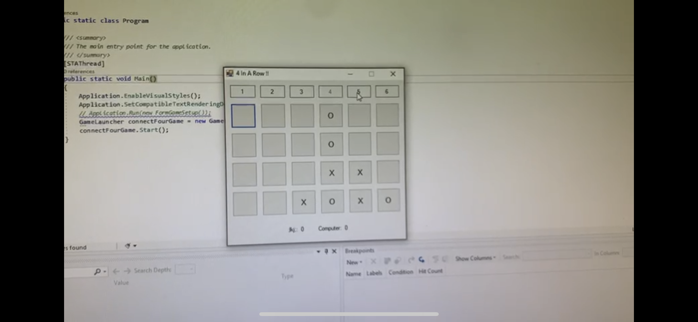

# C21-Ex05-Matan: 4 (or more) In-A-Row game

Final Assignment for Object Oriented Programming course, summer semester, 2021, at IDC, taught by Ronen Guy. 

Feautres:
* Change the number of rows and/or columns.
* Two modes of play: Player vs. Player and Player vs. Computer.

Screenshot from player vs. computer mode:

Notice that the game dimensions are 4-by-6.
